# EVIS AI Pipeline

Mapa dos dois motores de IA do EVIS: comercial/tecnico (Orcamentista) e operacional (Diario de Obra).

Os dois motores sao distintos e tem fronteira temporal:
- **Orcamentista IA** — atua antes da obra existir.
- **Diario de Obra IA** — atua depois da obra existir.

Ambos usam HITL. Nenhum grava dados criticos sem aprovacao humana.

```mermaid
flowchart TB
  Lead["Lead / Oportunidade"]

  subgraph Commercial["Motor 1 — Orcamentista IA (antes da obra existir)"]
    Files["Arquivos de projeto\nPDF, planta, memoria, especificacao"]
    Reader["Reader\nleitura multimodal"]
    Planner["Planner\nroteiro tecnico por disciplina"]
    HitlC1["HITL\naprovacao do roteiro"]
    Specialists["Especialistas\nquantitativos por disciplina"]
    Costs["Composicao de custos\nSINAPI + base propria"]
    HitlC2["HITL\nrevisao dos itens"]
    BudgetItems["Orcamento estruturado\norcamento_itens"]
    Proposal["Proposta comercial"]

    Files --> Reader
    Reader --> Planner
    Planner --> HitlC1
    HitlC1 -->|"aprovado"| Specialists
    Specialists --> Costs
    Costs --> HitlC2
    HitlC2 -->|"aprovado"| BudgetItems
    BudgetItems --> Proposal
  end

  Closing["Ganhar / Fechamento\nObra criada"]

  subgraph Operational["Motor 2 — Diario de Obra IA (depois da obra existir)"]
    Capture["Captura diaria\ntexto, audio, foto, print, arquivo"]
    Orchestrator["Orquestrador"]
    Classify["Classificacao por dominio"]
    Agents["Subagentes\nDiario, Cronograma, Equipes,\nPendencias, Financeiro, Cliente"]
    Proposals["Propostas de atualizacao"]
    HitlO["HITL\nusuario confirma"]
    Supabase["Supabase\nservicos, pendencias, notas, presenca"]
    Dashboard["Dashboard atualizado"]

    Capture --> Orchestrator
    Orchestrator --> Classify
    Classify --> Agents
    Agents --> Proposals
    Proposals --> HitlO
    HitlO -->|"aprovado"| Supabase
    Supabase --> Dashboard
  end

  Lead --> Files
  Proposal --> Closing
  Closing --> Capture
```



## Principio central

```text
IA propoe -> Humano valida -> Sistema registra
```

## Resumo dos motores

| Propriedade | Orcamentista IA | Diario de Obra IA |
|---|---|---|
| Momento | Antes da obra existir | Depois da obra existir |
| Entrada principal | Arquivos de projeto e briefing | Captura diaria de campo |
| Saida principal | orcamento_itens + proposta | Obra atualizada no Supabase |
| HITL | Por checkpoint tecnico (roteiro e itens) | Antes de cada gravacao |
| Grava automaticamente | Nunca | Nunca |
| Interface | Chat como entrada de motor tecnico | Cockpit operacional do diario |
| Status atual | Parcial: Reader/Planner/HITL reais; gravacao em orcamento_itens pendente | Parcial funcional no frontend com HITL |

