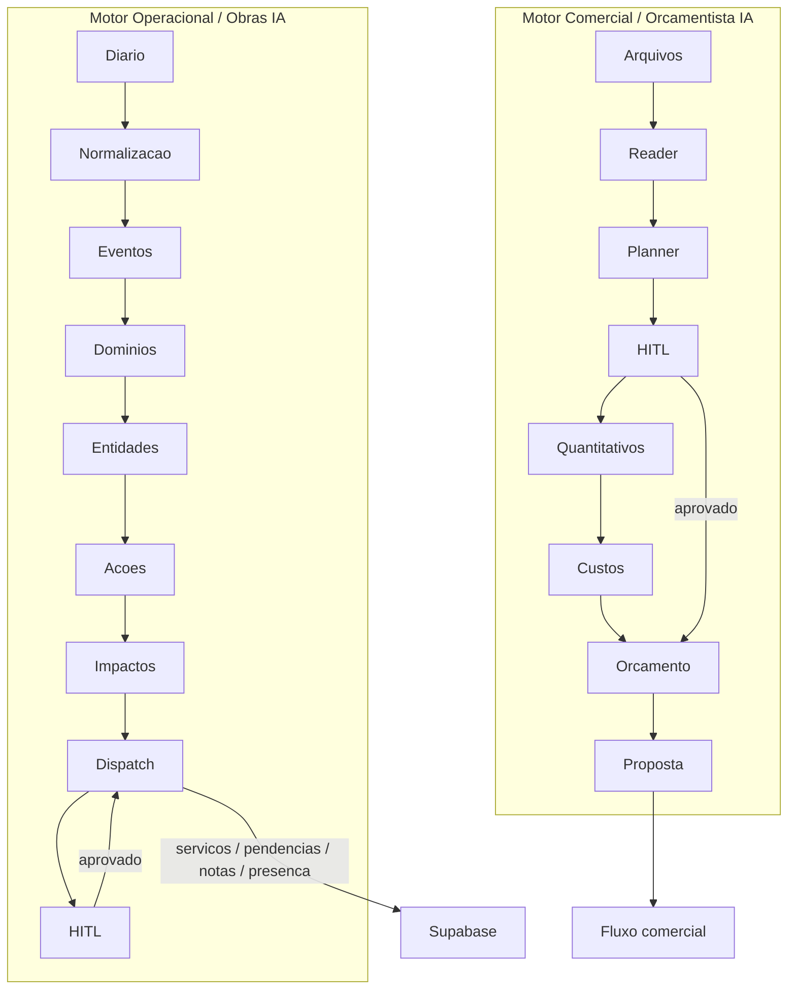

# EVIS AI Pipeline

Mapa dos dois motores de IA em evolucao: comercial/tecnico e operacional.



## Principios

```text
IA propoe -> Humano valida -> Sistema registra
```

| Motor | Entrada | Saida esperada | Status atual |
|---|---|---|---|
| Comercial / Orçamentista IA | Workspace, arquivos, briefing e chat | Roteiro, quantitativos, custos, orcamento e proposta | Parcial: Reader/Planner/HITL reais; quantitativos/custos ainda incompletos |
| Operacional / Obras IA | Diario de obra e contexto operacional | Atualizacoes propostas para servicos, pendencias, notas e presenca | Parcial funcional no frontend com HITL |

