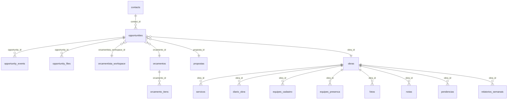
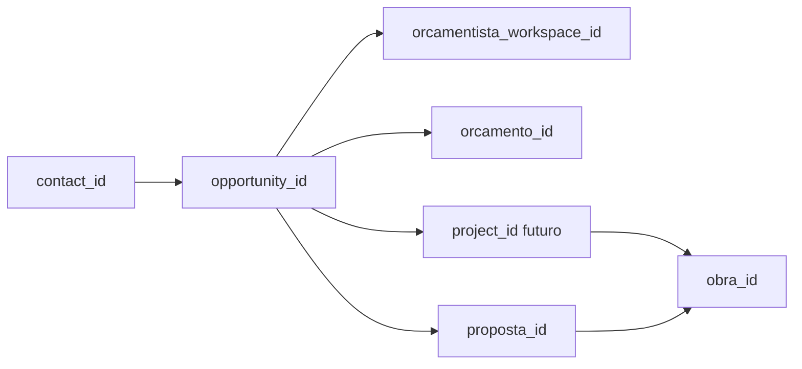

# EVIS Database Map

Mapa vivo das entidades relevantes para Oportunidades, Orcamentista, Orcamentos e Obras.

## Entidades e Status

| Entidade | Status | Observacao |
|---|---|---|
| `contacts` | Criada no Supabase | Base minima de contatos do MVP de Oportunidades |
| `opportunities` | Criada no Supabase | Lead/oportunidade antes de obra |
| `opportunity_events` | Criada no Supabase (já usada na tela de detalhe) |
| `opportunity_files` | Criada no Supabase | Arquivos de briefing/documentos iniciais |
| `orcamentista_workspace_id` | Parcial | Referencia textual para workspace do Orçamentista |
| `orcamentos` | Existe | Usado pelo modulo de Orcamento |
| `orcamento_itens` | Existe | Itens do orcamento estruturado |
| `propostas` / `projects` | Ainda nao existem | `proposta_id` fica sem FK no MVP |
| `obras` | Existe | Entidade operacional principal |
| `servicos` | Existe | Servicos da obra |
| `diario_obra` | Existe | Narrativas/transcricoes de obra |
| `equipes_cadastro` / `equipes_presenca` | Existe | Cadastro e presenca de equipes |
| `fotos` | Existe | Registro fotografico |
| `notas` | Existe | Notas da obra |
| `pendencias` | Existe | Pendencias operacionais |
| `relatorios_semanais` | Ausente | Citada no sync; precisa reconciliacao de schema |

## Relação Recomendada de IDs

