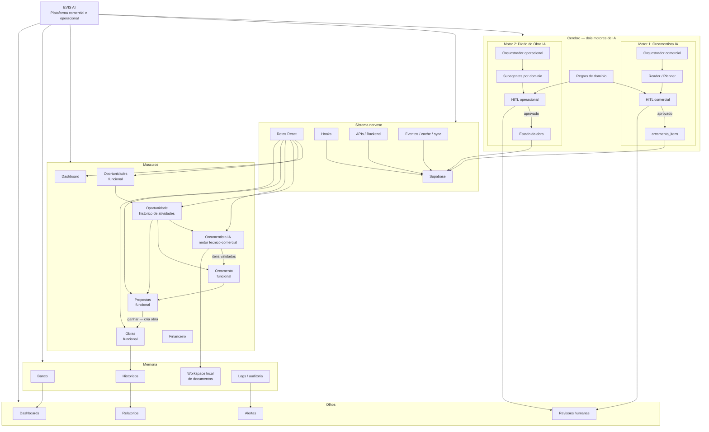

# EVIS Master Map

Mapa vivo do organismo EVIS, separando produto, inteligência, dados e interfaces.

## Leitura Rapida

| Camada | Funcao | Estado atual |
|---|---|---|
| Cerebro | Dois motores de IA (Orcamentista e Diario), regras e HITL | Motor Diario parcial funcional; Motor Orcamentista com Reader/Planner/HITL reais, gravacao em orcamento_itens pendente |
| Sistema nervoso | Supabase, rotas, hooks, APIs, eventos e cache | Implementado em partes, contratos em reconciliacao |
| Musculos | Modulos de produto que executam fluxos do usuario | Dashboard, Oportunidades, Orcamentista, Orcamento, Proposta e Obras funcionais; demais modulos parciais |
| Memoria | Banco, workspace de documentos, historicos e logs | Supabase e workspace local; auditoria ainda fragmentada |
| Olhos | Dashboards, relatorios, alertas e revisoes humanas | Parcial; relatorios e alertas precisam consolidacao |

Conversao de oportunidade em obra: cria registro em `public.obras` e popula `opportunities.obra_id`.
