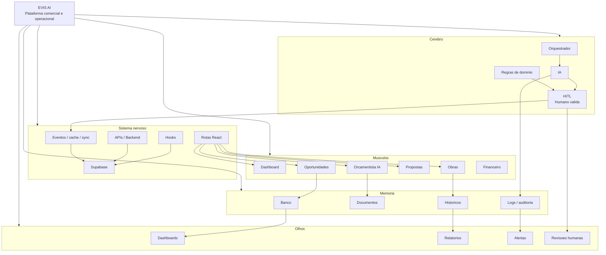

# EVIS Master Map

Mapa vivo do organismo EVIS, separando produto, inteligência, dados e interfaces.

## Leitura Rapida

| Camada | Funcao | Estado atual |
|---|---|---|
| Cerebro | Orquestracao, IA, regras e validacao humana | Parcial, com HITL real em Diario e Orçamentista |
| Sistema nervoso | Supabase, rotas, hooks, APIs, eventos e cache | Implementado em partes, ainda com contratos em reconciliacao |
| Musculos | Modulos de produto que executam fluxos do usuario | Dashboard, Oportunidades e Obras ativos; demais parciais |
| Memoria | Banco, documentos, historicos e logs | Supabase e workspace local; auditoria ainda fragmentada |
| Olhos | Dashboards, relatorios, alertas e revisoes | Parcial; relatorios e alertas ainda precisam consolidacao |

