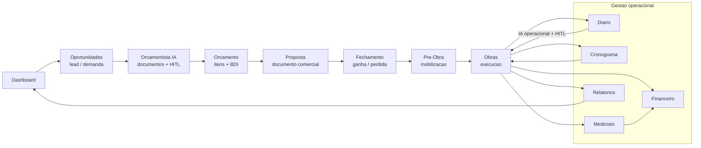

# EVIS Product Flow

Fluxo principal previsto para conectar entrada comercial, engenharia, proposta, fechamento e execucao.

## Estado do Fluxo

| Etapa | Papel no produto | Estado |
|---|---|---|
| Dashboard | Comando central e entrada dos modulos | Implementado como hub |
| Oportunidades | Registro comercial antes de obra | Módulo inicial funcional do fluxo comercial |
| Orçamentista IA | Leitura tecnica, planner e HITL | Parcial funcional |
| Orcamento | Estrutura de itens e totais | Parcial implementado |
| Proposta | Apresentacao comercial a partir de JSON | Parcial, sem persistencia completa |
| Fechamento | Conversao comercial | Planejado |
| Pre-Obra | Preparacao entre venda e execucao | Planejado |
| Obras | Execucao operacional preservada | Implementado/parcial |
| Diario/Cronograma/Medicoes/Financeiro/Relatorios | Operacao e controle | Diario e cronograma parciais; financeiro/medicoes planejados |

