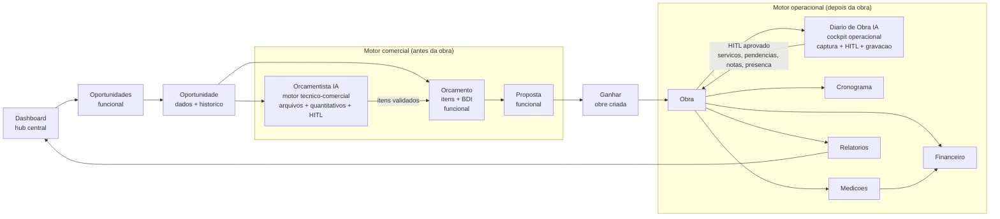

# EVIS Product Flow

Fluxo principal que conecta entrada comercial, motor de orcamento IA, proposta, fechamento e execucao operacional.

O fluxo e dividido em duas fases com fronteira clara no momento do fechamento:

- **Fase comercial** (antes da obra): Oportunidade -> Orcamentista IA -> Orcamento -> Proposta -> Ganhar.
- **Fase operacional** (depois da obra): Obra -> Diario de Obra IA -> Atualizacoes validadas.

## Estado do Fluxo

| Etapa | Papel no produto | Estado |
|---|---|---|
| Dashboard | Comando central e entrada dos modulos | Implementado como hub |
| Oportunidades | Registro comercial antes de obra, com lista, criacao rapida e detalhe | Funcional |
| Oportunidade (detalhe) | Dados da oportunidade e historico de atividades | Funcional, usando `opportunity_events` |
| Orcamentista IA | Motor tecnico-comercial: arquivos, quantitativos, composicao de custos, HITL | Parcial: Reader/Planner/HITL reais; gravacao automatica em `orcamento_itens` pendente |
| Orcamento | Estrutura de itens e totais com BDI | Funcional (criacao manual e via oportunidade) |
| Proposta | Apresentacao comercial a partir do orcamento | Funcional |
| Ganhar / Fechamento | Conversao da oportunidade em obra | Funcional — cria registro em `public.obras` e popula `opportunities.obra_id` |
| Pre-Obra | Preparacao entre venda e execucao | Planejado |
| Obra | Modulo operacional com servicos, equipes, diario e financeiro | Funcional — preservado em `/obras` e `/obras/:obraId` |
| Diario de Obra IA | Motor operacional: captura diaria, HITL, gravacao validada | Parcial funcional no frontend com HITL |
| Cronograma / Medicoes / Financeiro / Relatorios | Operacao e controle de obra | Diario e cronograma parciais; financeiro/medicoes planejados |
