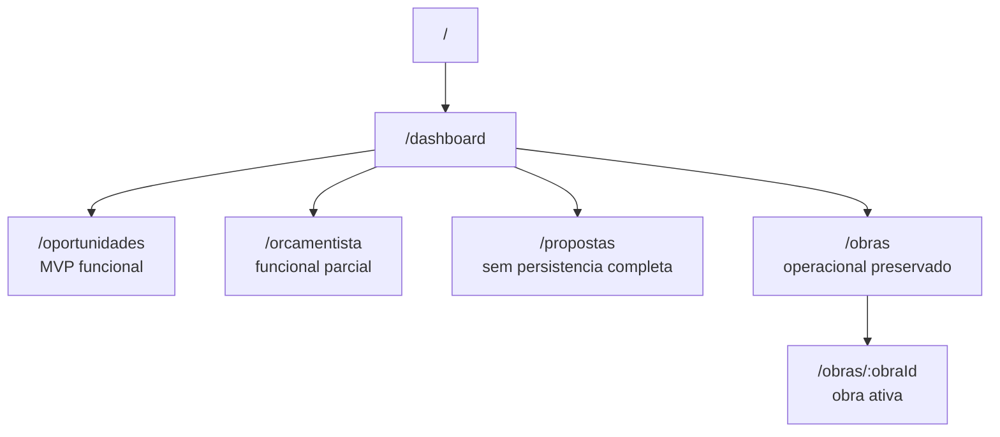

# EVIS Routes Map

Rotas atuais observadas em `src/App.tsx`.

## Status por Rota

| Rota | Componente | Status |
|---|---|---|
| `/` | `DashboardPage` | Hub implementado |
| `/dashboard` | `DashboardPage` | Hub implementado |
| `/oportunidades` | `OportunidadesPage` | MVP funcional com listagem/criacao via Supabase |
| `/orcamentista` | `OrcamentistaChat` | Funcional parcial, ainda ligado a workspace/obra |
| `/propostas` | `PropostaPage` | Existe, transforma JSON em proposta visual; sem persistencia completa |
| `/obras` | `Main` | Modulo operacional preservado |
| `/obras/:obraId` | `Main` | Modulo operacional com obra ativa pela URL |

